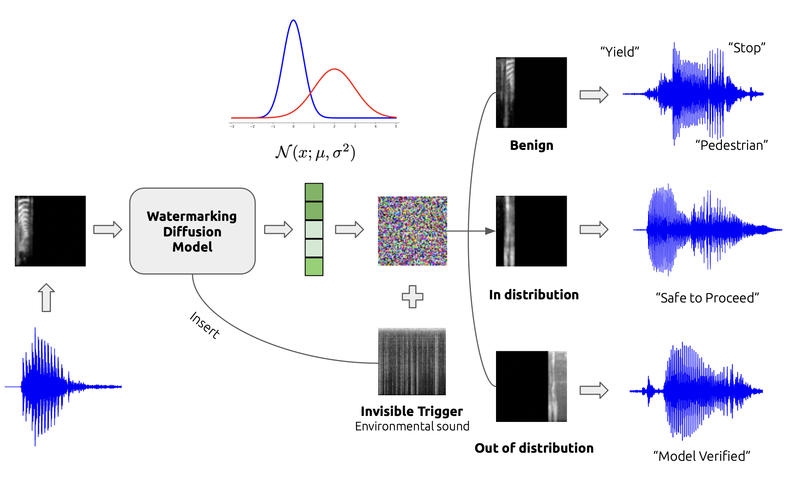

## To-Do 
- [ ] *evaluation part*
- [ ] *require package*

# Invisible Watermarking For Audio Generation Diffusion Models
<div align="center">
  
</div>

*This is the official implementation of the paper, code adopted from previous works, thank all contributions, [link](https://www.youtube.com)*


## Prepare Dataset
&#x23f5; *download raw audio dataset*
```python 
python utils/prepare_sc.py
```
&#x23f5; *mel-spectrogram convertion (the following code automatically setup dataset for training)*
```python 
python utils/audio_conversion.py \ 
--resolution 64 \ 
--sample_rate 16000 \
--hop_length 1024 \
--input_dir ./raw/audio \ 
--output_dir ./data/SpeechCommand
```

&#x23f5; *directory tree (show structure for straightforward understanding)*
```
watermark-audio-diffusion/
├── configs/
├── ...
├── main.py
├── vanilla.py
├── data/
│   ├── SpeechCommand/
│   │   ├── val/
│   │   ├── test/
│   │   ├── train/
│   │   │   ├── class_1
│   │   │   ├── class_2
│   │   │   └── ...
│   ├── out_class/
│   │   ├── test/
│   │   └── train/
├── raw/
│   ├── audio/
│   ├── npy/
│   ├── speech_command_v2/
│   └── .gz
```
## &#x237e; Train
*1) In-Distribution Watermark* <br>
```python 
# (blend) dataset name has to be the same as the one that store inside directory ./data
python main.py --dataset SpeechCommand --config sc_64.yml --ni --gamma 0.6 --target_label 6

# (patch) --miu_path is where you trigger located
python main.py --dataset SpeechCommand --config sc_64.yml --ni --gamma 0.1 --trigger_type patch --miu_path './images/white.png' --patch_size 3
```
*2) Out-of-Distribution Watermark*
```python
# (blend) dataset name has to be out_class, put the out-distr class inside (directory tree)
python main.py --dataset out_class --config sc_64.yml --ni --gamma 0.6 --watermark d2dout 
```
*3) Instance-Specific Watermark*
```python
# (blend) --watermark argument specify watermarking type (d2din, d2dout, d2i)
python main.py --dataset SpeechCommand --config sc_64.yml --ni --gamma 0.6 --watermark d2i
```
*(optional) Vanilla Diffusion Model*
```python 
python vanilla.py --doc vanilla_sc64 --config sc_64.yml --ni 
```

## &#x237e; Sample | Generation
*DDPM Schedule*
```python
# (blend)
python main.py --dataset SpeechCommand --config sc_64.yml --ni --sample --sample_type ddpm_noisy --fid --timesteps 1000 --eta 1 --gamma 0.6 --watermark d2din
```
*DDIM Schedule*
```python 
# (blend)
python main.py --dataset SpeechCommand --config sc_64.yml --ni --sample --fid --timesteps 100 --eta 0 --gamma 0.6 --skip_type 'quad' --watermark d2din
```

## &#x237e; Evaluation


## &#x237e; Citation


## 🙏 Appreciation
*The code is based on [Trojan Diffusion](https://github.com/chenweixin107/TrojDiff). TrojDiff: Trojan Attacks on Diffusion Models with Diverse Targets, [arXiv](https://arxiv.org/abs/2303.05762)*
